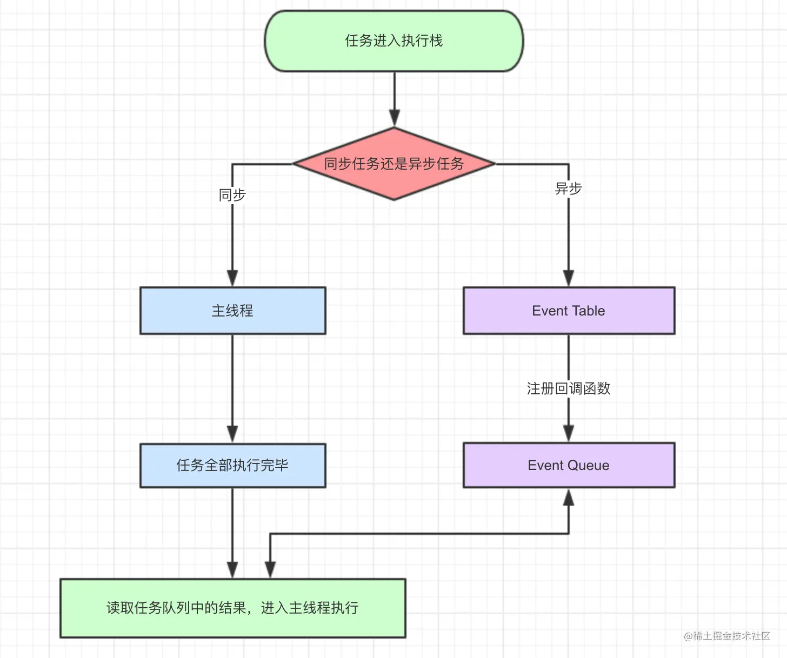

# js事件执行顺序
## async/await、promise和setTimeout的执行顺序

### 先看一道例题
```
async function async1() {
	console.log('async1 start');
	await async2();
	console.log('asnyc1 end');
}
async function async2() {
	console.log('async2');
}
console.log('script start');
setTimeout(() => {
	console.log('setTimeOut');
}, 0);
async1();
new Promise(function (reslove) {
	console.log('promise1');
	reslove();
}).then(function () {
	console.log('promise2');
})
console.log('script end');
```

输出结果
```
script start
async1 start
async2
promise1
script end
asnyc1 end
promise2
setTimeOut
```

为啥会是这样的呢，需要先了解事件循环机制

js EventLoop 事件循环机制


宏任务(macro-task)|微任务(micro-task)|
|:---|:---|
|script|promise.[ then/catch/finally ]((非new Promise))|
|setTimeout|process.nextTick(Node.js 环境)|
|setInterval|MutaionOberver（浏览器环境）|
|setImmediate(Node.js 环境)	|Object.observe|
|IO操作|X|
|UI交互事件|X|
|postMessage|X|
|MessageChanne|X|

事件的执行顺序，是先执行宏任务，然后执行微任务，这个是基础，任务可以有同步任务和异步任务，同步的进入主线程，异步的进入Event Table并注册函数，异步事件完成后，会将回调函数放入Event Queue中(宏任务和微任务是不同的Event Queue)，同步任务执行完成后，会从Event Queue中读取事件放入主线程执行，回调函数中可能还会包含不同的任务，因此会循环执行上述操作。



> 注意： setTimeOut并不是直接的把你的回掉函数放进上述的异步队列中去，而是在定时器的时间到了之后，把回掉函数放到执行异步队列中去。如果此时这个队列已经有很多任务了，那就排在他们的后面。这也就解释了为什么setTimeOut为什么不能精准的执行的问题了。setTimeOut执行需要满足两个条件：

1. 主进程必须是空闲的状态，如果到时间了，主进程不空闲也不会执行你的回调函数
2. 这个回调函数需要等到插入异步队列时前面的异步函数都执行完了，才会执行


promise、async/await

首先，new Promise是同步的任务，会被放到主进程中去立即执行。而.then()函数是异步任务会放到异步队列中去，那什么时候放到异步队列中去呢？当你的promise状态结束的时候，就会立即放进异步队列中去了。
带async关键字的函数会返回一个promise对象，如果里面没有await，执行起来等同于普通函数；如果没有await，async函数并没有很厉害是不是。

await 关键字要在 async 关键字函数的内部，await 写在外面会报错；await如同他的语意，就是在等待，等待右侧的表达式完成。此时的await会让出线程，阻塞async内后续的代码，先去执行async外的代码。等外面的同步代码执行完毕，才会执行里面的后续代码。就算await的不是promise对象，是一个同步函数，也会等这样操作。

流程梳理
> 我们整体再梳理一下上面代码执行的流程：

1. 整个代码片段（script）作为一个宏任务执行console.log('script start')，输出script start；
2. 执行setTimeout，是一个异步动作，放入宏任务异步队列中；
3. 执行async1()，输出async1 start，继续向下执行；
4. 执行async2()，输出async2，并返回了一个promise对象，await让出了线程，把返回的promise加入了微任务异步队列，所以async1()下面的代码也要等待上面完成后继续执行;
5. 执行 new Promise，输出promise1，然后将resolve()放入微任务异步队列；
6. 执行console.log('script end')，输出script end；
7. 到此同步的代码就都执行完成了，然后去微任务异步队列里去获取任务
8. 接下来执行resolve（async2返回的promise返回的），输出了async1 end；
9. 然后执行resolve（new Promise的），输出了promise2；
10. 最后执行setTimeout，输出了settimeout。


在第4步中， await 这里有一个机制， 就是 await 的等待， 不会阻塞外部函数的执行， 而 await 等待的 如果是一个 Promise 则 Promise 里面的代码还是同步执行， 如果不是 Promise ，就会使用 Promise.resolve 来进行封装， 这里的 async2 是一个 async 方法， 里面的 打印会同步执行， 而 await async2() 后面的代码 会放到微任务队列中的第一个位置，等待外部同步代码执行完毕以后再执行。
所以我知道了script end为什么会优先于async1 end输出。

