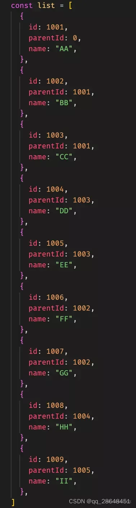
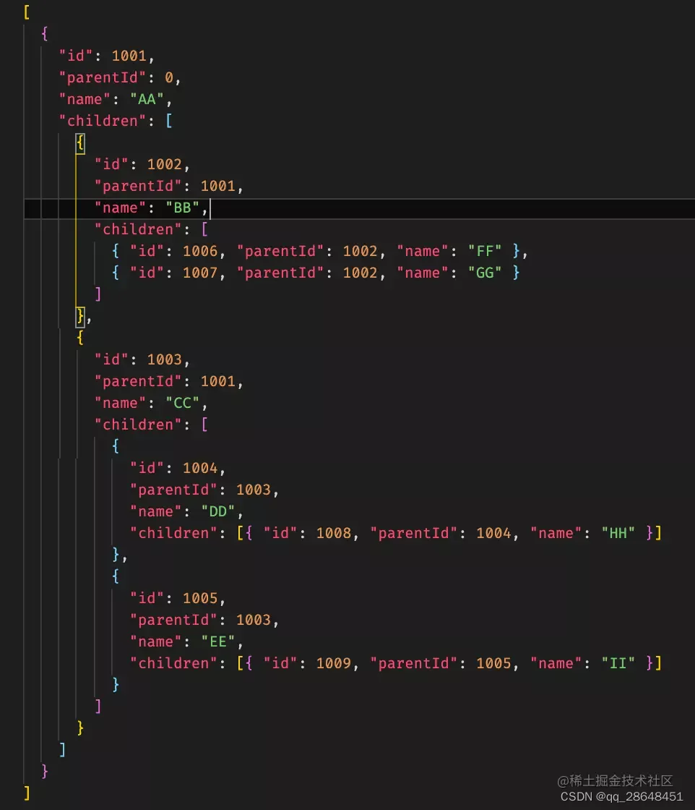

# 封装数的结构

## js将列表组装成树结构的两种方式

原始数据：



目标结构：


实现的方式分三种:

1. 方法一：
最直接的方式就是遍历数组，并把找到的子节点逐一添加到父节点中
```js
function listToTreeSimple(data) {
	const res = [];
	data.forEach((item) => {
		const parent = data.find((node) => node.id === item.parentId);
		if (parent) {
			parent.children = parent.children || [];
			parent.children.push(item);
		} else {
			res.push(item);
		}
	});
	return res;
}
```
2. 方法二：考虑进一步优化，使用哈希表，以id为key存储每个节点值，省去data.find计算
```js
function listToTree(data) {
	const obj = {};
	data.forEach((item) => {
		obj[item.id] = item;
	});
	const parentList = [];
	data.forEach((item) => {
		const parent = obj[item.parentId];
		if (parent) {
			parent.children = parent.children || [];
			parent.children.push(item);
		} else {
			parentList.push(item);
		}
	});
	return parentList;
}
```
3. 方法三：递归法
```js
function recursiveToTree(data) {
	function loop(key) {
		const arr = [];
		data.forEach((item) => {
			if (item.parentId === key) {
				item.children = loop(item.id);
				arr.push(item);
			}
		});
		return res;
	}
	return loop(1);
}
```
