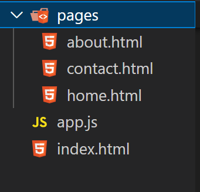

# 原生Js实现路由

## 文件目录


index.html
```html
<!DOCTYPE html>
<html lang="en">
<head>
    <meta charset="UTF-8">
    <meta http-equiv="X-UA-Compatible" content="IE=edge">
    <meta name="viewport" content="width=device-width, initial-scale=1.0">
    <title>Document</title>
</head>
<body>
    <nav>
        <a href="/">home</a>
        <a href="/about">about</a>
        <a href="/contact">contact</a>
    </nav>
    <div id="root"></div>
    <script src="app.js"></script>
</body>
</html>
```

app.js
```js
const routers={
    "404":{
        "pages":"/pages/404.html",
        "title":"not found",
    },
    "/":{
        "pages":"/pages/home.html",
        "title":"home"
    },
    "/about":{
        "pages":"/pages/about.html",
        "title":"about"
    },
    "/contact":{
        "pages":"/pages/contact.html",
        "title":"contact"
    }
}
document.querySelector("nav").addEventListener('click',(e)=>{
    e.preventDefault();
    useRouter(e);
})

const useRouter = (e)=>{
    console.log(e);
    e=e||window.event;
    window.history.pushState({},'',e.target.href);
    renderPage();
}

const renderPage= async()=>{
    const location = window.location.pathname;
    console.log(location);
    const route = routers[location]||routers[404];
    const response = await fetch(route.pages);
    const data = await response.text();
    console.log(response);
    document.querySelector("#root").innerHTML=data;
}

window.onpopstate=renderPage();
```

