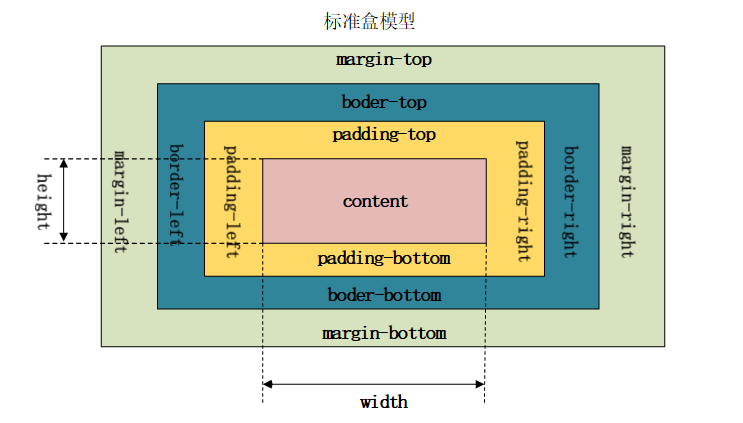

# css基础

## 1.css选择器
|选择器|格式|优先级权重|
|:---|:---|:---|
|id选择器|#id|100|
|类选择器|#classname|10|
|属性选择器|a[ref=“eee”]|10|
|伪类选择器|li:last-child|10|
|标签选择器|div|1|
|伪元素选择器|li:after|1|
|相邻兄弟选择器|h1+p|0|
|子选择器|ul>li|0|
|后代选择器|li a|0|
|通配符选择器|*|0|

### 对于选择器的优先级：
1. 标签选择器、伪元素选择器：1
2. 类选择器、伪类选择器、属性选择器：10
3. id 选择器：100
4. 内联样式：1000

> 注意事项：
!important声明的样式的优先级最高；<br/>
如果优先级相同，则最后出现的样式生效；<br/>
继承得到的样式的优先级最低；<br/>
通用选择器（*）、子选择器（>）和相邻同胞选择器（+）并不在这四个等级中，所以它们的权值都为 0 ；<br/>
样式表的来源不同时，优先级顺序为：内联样式 > 内部样式 > 外部样式 > 浏览器用户自定义样式 > 浏览器默认样式。

## 2.css中可继承与不可继承属性有哪些

### 一、无继承性的属性
1. display：规定元素应该生成的框的类型
2. 文本属性：
vertical-align：垂直文本对齐
text-decoration：规定添加到文本的装饰
text-shadow：文本阴影效果
white-space：空白符的处理
unicode-bidi：设置文本的方向
3. 盒子模型的属性：width、height、margin、border、padding
4. 背景属性：background、background-color、background-image、background-repeat、background-position、background-attachment
5. 定位属性：float、clear、position、top、right、bottom、left、min-width、min-height、max-width、max-height、overflow、clip、z-index
6. 生成内容属性：content、counter-reset、counter-increment
7. 轮廓样式属性：outline-style、outline-width、outline-color、outline
8. 页面样式属性：size、page-break-before、page-break-after
9. 声音样式属性：pause-before、pause-after、pause、cue-before、cue-after、cue、play-during


### 二、有继承性的属性
1. 字体系列属性：
    - font-family：字体系列
    - font-weight：字体的粗细
    - font-size：字体的大小
    - font-style：字体的风格
2. 文本系列属性
    - text-indent：文本缩进
    - text-align：文本水平对齐
    - line-height：行高
    - word-spacing：单词之间的间距
    - letter-spacing：中文或者字母之间的间距
    - text-transform：控制文本大小写（就是uppercase、lowercase、capitalize这三个）
    - color：文本颜色
3. 元素可见性
    - visibility：控制元素显示隐藏
4. 列表布局属性
    - list-style：列表风格，包括list-style-type、list-style-image等
5. 光标属性
    - cursor：光标显示为何种形态

## 3. display的属性值及其作用
|属性值|作用|
|:---|:---|
|none|元素不显示，并且会从文档流中移除。|
|block|块类型。默认宽度为父元素宽度，可设置宽高，换行显示。|
|inline|行内元素类型。默认宽度为内容宽度，不可设置宽高，同行显示。|
|inline-block|默认宽度为内容宽度，可以设置宽高，同行显示。|
|list-item|像块类型元素一样显示，并添加样式列表标记。|
|table|此元素会作为块级表格来显示。|
|inherit|规定应该从父元素继承display属性的值。|
|flex|弹性布局|
|grid|网格布局|

## 4. display的block、inline和inline-block的区别
1. block： 会独占一行，多个元素会另起一行，可以设置width、height、margin和padding属性；
2. inline： 元素不会独占一行，设置width、height属性无效。但可以设置水平方向的margin和padding属性，不能设置垂直方向的padding和margin；
3. inline-block： 将对象设置为inline对象，但对象的内容作为block对象呈现，之后的内联对象会被排列在同一行内

对于行内元素和块级元素，其特点如下：
1. 行内元素
    - 设置宽高无效；
    - 可以设置水平方向的margin和padding属性，不能设置垂直方向的padding和margin；
    - 不会自动换行；

2. 块级元素
    - 可以设置宽高；
    - 设置margin和padding都有效；
    - 可以自动换行；
    - 多个块状，默认排列从上到下。

## 5. 隐藏元素的方法有哪些

1. display: none：渲染树不会包含该渲染对象，因此该元素不会在页面中占据位置，也不会响应绑定的监听事件。
2. visibility: hidden：元素在页面中仍占据空间，但是不会响应绑定的监听事件。
3. opacity: 0：将元素的透明度设置为 0，以此来实现元素的隐藏。元素在页面中仍然占据空间，并且能够响应元素绑定的监听事件。
4. position: absolute：通过使用绝对定位将元素移除可视区域内，以此来实现元素的隐藏。
5. z-index: 负值：来使其他元素遮盖住该元素，以此来实现隐藏。
6. clip/clip-path ：使用元素裁剪的方法来实现元素的隐藏，这种方法下，元素仍在页面中占据位置，但是不会响应绑定的监听事件。
7. transform: scale(0,0)：将元素缩放为 0，来实现元素的隐藏。这种方法下，元素仍在页面中占据位置，但是不会响应绑定的监听事件。

## 6. link和@import的区别

1. 两者都是外部引用CSS的方式，它们的区别如下：
    - link是XHTML标签，除了加载CSS外，还可以定义RSS等其他事务；@import属于CSS范畴，只能加载CSS。
    - link引用CSS时，在页面载入时同时加载；@import需要页面网页完全载入以后加载。
    - link是XHTML标签，无兼容问题；@import是在CSS2.1提出的，低版本的浏览器不支持。
    - link支持使用Javascript控制DOM去改变样式；而@import不支持。

## 7. transition和animation的区别

1. transition是过度属性，强调过度，它的实现需要触发一个事件（比如鼠标移动上去，焦点，点击等）才执行动画。它类似于flash的补间动画，设置一个开始关键帧，一个结束关键帧。
2. animation是动画属性，它的实现不需要触发事件，设定好时间之后可以自己执行，且可以循环一个动画。它也类似于flash的补间动画，但是它可以设置多个关键帧（用@keyframe定义）完成动画。

## 8. display:none与visibility:hidden的区别

这两个属性都是让元素隐藏，不可见。两者区别如下：
1. 在渲染树中
    - display:none会让元素完全从渲染树中消失，渲染时不会占据任何空间；
    - visibility:hidden不会让元素从渲染树中消失，渲染的元素还会占据相应的空间，只是内容不可见。
2. 是否是继承属性
    - display:none是非继承属性，子孙节点会随着父节点从渲染树消失，通过修改子孙节点的属性也无法显示；
    - visibility:hidden是继承属性，子孙节点消失是由于继承了hidden，通过设置visibility:visible可以让子孙节点显示；
3. 修改常规文档流中元素的 display 通常会造成文档的重排，但是修改visibility属性只会造成本元素的重绘；
4. 如果使用读屏器，设置为display:none的内容不会被读取，设置为visibility:hidden的内容会被读取。

## 9. 伪元素和伪类的区别和作用？

伪元素：在内容元素的前后插入额外的元素或样式，但是这些元素实际上并不在文档中生成。它们只在外部显示可见，但不会在文档的源代码中找到它们，因此，称为“伪”元素。例如：

```css
p::before {content:"第一章：";}
p::after {content:"Hot!";}
p::first-line {background:red;}
p::first-letter {font-size:30px;}
```
伪类：将特殊的效果添加到特定选择器上。它是已有元素上添加类别的，不会产生新的元素。例如：

```css
a:hover {color: #FF00FF}
p:first-child {color: red}
```
总结： 伪类是通过在元素选择器上加⼊伪类改变元素状态，⽽伪元素通过对元素的操作进⾏对元素的改变

## 10. 对requestAnimationframe的理解

实现动画效果的方法比较多，Javascript 中可以通过定时器 setTimeout 来实现，CSS3 中可以使用 transition 和 animation 来实现，HTML5 中的 canvas 也可以实现。除此之外，HTML5 提供一个专门用于请求动画的API，那就是 requestAnimationFrame，顾名思义就是请求动画帧。

MDN对该方法的描述：
> window.requestAnimationFrame() 告诉浏览器——你希望执行一个动画，并且要求浏览器在下次重绘之前调用指定的回调函数更新动画。该方法需要传入一个回调函数作为参数，该回调函数会在浏览器下一次重绘之前执行。

语法： window.requestAnimationFrame(callback);  其中，callback是下一次重绘之前更新动画帧所调用的函数(即上面所说的回调函数)。该回调函数会被传入DOMHighResTimeStamp参数，它表示requestAnimationFrame() 开始去执行回调函数的时刻。该方法属于宏任务，所以会在执行完微任务之后再去执行。<br/>

取消动画： 使用cancelAnimationFrame()来取消执行动画，该方法接收一个参数——requestAnimationFrame默认返回的id，只需要传入这个id就可以取消动画了。

优势：
1. CPU节能：使用SetTinterval 实现的动画，当页面被隐藏或最小化时，SetTinterval 仍然在后台执行动画任务，由于此时页面处于不可见或不可用状态，刷新动画是没有意义的，完全是浪费CPU资源。而RequestAnimationFrame则完全不同，当页面处理未激活的状态下，该页面的屏幕刷新任务也会被系统暂停，因此跟着系统走的RequestAnimationFrame也会停止渲染，当页面被激活时，动画就从上次停留的地方继续执行，有效节省了CPU开销。
2. 函数节流：在高频率事件( resize, scroll 等)中，为了防止在一个刷新间隔内发生多次函数执行，RequestAnimationFrame可保证每个刷新间隔内，函数只被执行一次，这样既能保证流畅性，也能更好的节省函数执行的开销，一个刷新间隔内函数执行多次时没有意义的，因为多数显示器每16.7ms刷新一次，多次绘制并不会在屏幕上体现出来。
3. 减少DOM操作：requestAnimationFrame 会把每一帧中的所有DOM操作集中起来，在一次重绘或回流中就完成，并且重绘或回流的时间间隔紧紧跟随浏览器的刷新频率，一般来说，这个频率为每秒60帧。

setTimeout执行动画的缺点：它通过设定间隔时间来不断改变图像位置，达到动画效果。但是容易出现卡顿、抖动的现象；原因是：
1. settimeout任务被放入异步队列，只有当主线程任务执行完后才会执行队列中的任务，因此实际执行时间总是比设定时间要晚；
2. settimeout的固定时间间隔不一定与屏幕刷新间隔时间相同，会引起丢帧。


## 11. 对盒模型的理解



## 12. 为什么有时候⽤translate来改变位置⽽不是定位？
translate 是 transform 属性的⼀个值。改变transform或opacity不会触发浏览器重新布局（reflow）或重绘（repaint），只会触发复合（compositions）。⽽改变绝对定位会触发重新布局，进⽽触发重绘和复合。transform使浏览器为元素创建⼀个 GPU 图层，但改变绝对定位会使⽤到 CPU。 因此translate()更⾼效，可以缩短平滑动画的绘制时间。 ⽽translate改变位置时，元素依然会占据其原始空间，绝对定位就不会发⽣这种情况。

## 13. li 与 li 之间有看不见的空白间隔是什么原因引起的？如何解决？
浏览器会把inline内联元素间的空白字符（空格、换行、Tab等）渲染成一个空格。为了美观，通常是一个li放在一行，这导致li换行后产生换行字符，它变成一个空格，占用了一个字符的宽度。


解决办法：
1. 为li设置float:left。不足：有些容器是不能设置浮动，如左右切换的焦点图等。
2. 将所有li写在同一行。不足：代码不美观。
3. 将ul内的字符尺寸直接设为0，即font-size:0。不足：ul中的其他字符尺寸也被设为0，需要额外重新设定其他字符尺寸，且在Safari浏览器依然会出现空白间隔。
4. 消除ul的字符间隔letter-spacing:-8px，不足：这也设置了li内的字符间隔，因此需要将li内的字符间隔设为默认letter-spacing:normal


## 14.清除浮动的几种方式
1. 给父元素设置height
直接给父元素的height属性设一个固定值：
```css
.father {
    height: 100px;
}
```
2. clear: both
向父元素中最后一个子元素后添加一个div：
```html
<div class="father">
    <div class="son left"></div>
    <div class="son right"></div>
    <div class="clear"></div>
</div>
```
```css
.clear {
    clear: both;
}
```
3. 给父元素设置float
直接让父元素也浮动起来
```css
.father {
    float: left;
}
```

4. 给父元素设置overflow
overflow属性为元素对溢出内容的处理方式，可以将其值设置为hidden或者auto来包含子元素：
```css
.father {
    overflow: hidden;
    /* 或者 */
    /* overflow: auto; */
}
```

5. 给父元素设置after伪元素
可以添加一个不占用空间的after伪元素，将其clear属性设置为both：
```css
.father::after {
    content: '';
    display: block;
    clear: both;
}
```

> 推荐使用第5种方式