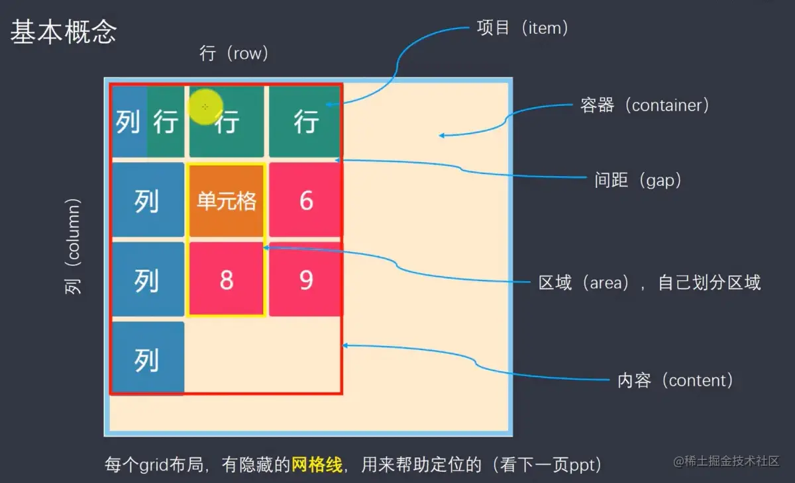

# grid 网格布局

## 基础知识
基础知识

1. 容器和项目
采用网格布局的区域，称为 “容器”（container）。容器内部采用网格定位的子元素，称为 “项目”（item）
```
<div>
  <div><p>1</p></div>
  <div><p>2</p></div>
  <div><p>3</p></div>
</div>
```
上面代码中，最外层的 div 元素就是容器，内层的三个 div 元素就是项目。
注意：项目只能是容器的顶层子元素，不包含项目的子元素，比如上面代码的 p 元素就不是项目。Grid 布局只对项目生效。

2. 行和列
容器里面的水平区域称为行row,垂直区域称为列column。
3. 单元格
行和列的交叉区域，称为 单元格（cell）。
正常情况下，n 行和 m 列会产生 n x m 个单元格。比如，3 行 3 列会产生 9 个单元格。
4. 网格线
划分网格的线，称为 网格线（grid line）。水平网格线划分出行，垂直网格线划分出列。
正常情况下，n 行有 n + 1 根水平网格线，m 列有 m + 1 根垂直网格线，比如三行就有四根水平网格线

### 容器属性
## display
```
display:grid
```
我们通过在元素上声明 display：grid 或 display：inline-grid 来创建一个网格容器。声明 display：grid 则该容器是一个块级元素，设置成 display: inline-grid 则容器元素为行内元素
## grid-template-columns
```
grid-template-columns:100px;
```
设置列宽
## grid-template-rows
设置行高
## grid-row-gap
设置行间距
## grid-column-gap
设置列间距
## grid-gap
设置行间距和列间距,grid-gap 属性是grid-row-gap跟 grid-column-gap简写
## grid-template-areas
定义区域，一个区域由一个或者多个单元格组成,一般这个属性跟网格元素的 grid-area 一起使用，
## grid-auto-flow
自动布局,默认值是 row
## justify-items
设置单元格内容的水平位置
## align-items
设置单元格内容的垂直位置
## place-items
设置单元格的水平垂直方向，是justify-items跟align-items的简写
## justify-content
内容区域在容器里面的水平位置
## align-content
内容区域在容器里面的垂直位置
## place-content
内容区域在容器里面的水平垂直位置,是justify-content跟align-content的简写
## grid-auto-columns
设置网格中列的默认大小
## grid-auto-rows
设置网格中行的默认大小
## grid-template
设置网格中行跟列的默认大小,是grid-auto-columns跟grid-auto-rows的简写
## grid 
grid 是一个所有网格容器的简写属性
grid 属性是以下属性的简写属性：
grid-template-rows
grid-template-columns
grid-template-areas
grid-auto-rows
grid-auto-columns
grid-auto-flow

### 项目属性
## grid-column-start
定义了网格元素从哪一列开始。
## grid-column-end
属性定义了网格元素跨越多少列，或者在哪一列结束。
## grid-row-start
定义了网格元素从哪一行开始。
## grid-row-end
属性定义了网格元素跨越多少行，或者在哪一行结束。
## grid-column
属性定义了网格元素列的开始和结束位置,grid-column 是 grid-column-start 和 grid-column-end 属性的简写属性。
## grid-row
grid-row 属性定义了网格元素行的开始和结束位置,grid-row 是 grid-row-start 和 grid-row-end 属性的简写属性。
## grid-area
属性指定网格元素在网格布局中的大小和位置
grid-area的简写是
grid-row-start
grid-column-start
grid-row-end
grid-column-end
## justify-self
属性设置单元格内容的水平位置
## align-self
属性设置单元格内容的垂直位置
## place-self
属性设置单元格内容的水平垂直位置，简写是justify-self,align-self

## 关键字
1. repeat()
2. auto-fill 关键字
3. fr 关键字
4. minmax()
5. auto 关键字
6. 网格线的名称

