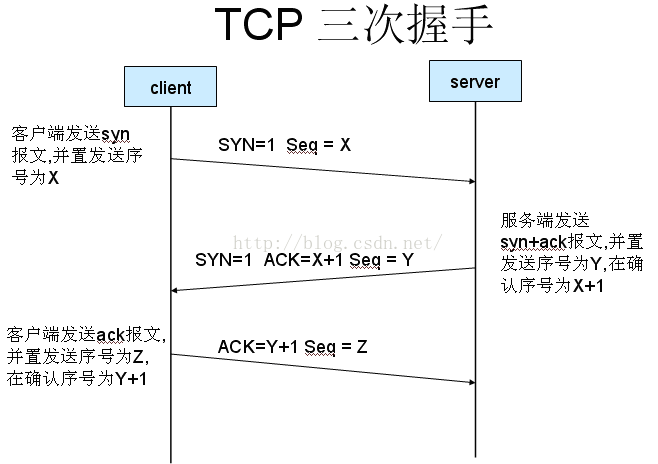

# TCP TCP／IP HTTP HTTPS

## 一.什么是TCP连接的三次握手
第一次握手：客户端发送syn包(syn=j)到服务器，并进入SYN_SEND状态，等待服务器确认；
第二次握手：服务器收到syn包，必须确认客户的SYN（ack=j+1），同时自己也发送一个SYN包（syn=k），即SYN+ACK包，此时服务器进入SYN_RECV状态；
第三次握手：客户端收到服务器的SYN＋ACK包，向服务器发送确认包ACK(ack=k+1)，此包发送完毕，客户端和服务器进入ESTABLISHED状态，完成三次握手。
握手过程中传送的包里不包含数据，三次握手完毕后，客户端与服务器才正式开始传送数据。理想状态下，TCP连接一旦建立，在通信双方中的任何一方主动关闭连接之前，TCP 连接都将被一直保持下去。断开连接时服务器和客户端均可以主动发起断开TCP连接的请求，断开过程需要经过“四次握手”（过程就不细写了，就是服务器和客户端交互，最终确定断开）




## 二. 利用Socket建立网络连接的步骤
建立Socket连接至少需要一对套接字，其中一个运行于客户端，称为ClientSocket ，另一个运行于服务器端，称为ServerSocket 。
套接字之间的连接过程分为三个步骤：服务器监听，客户端请求，连接确认。
1。服务器监听：服务器端套接字并不定位具体的客户端套接字，而是处于等待连接的状态，实时监控网络状态，等待客户端的连接请求。
2。客户端请求：指客户端的套接字提出连接请求，要连接的目标是服务器端的套接字。为此，客户端的套接字必须首先描述它要连接的服务器的套接字，指出服务器端套接字的地址和端口号，然后就向服务器端套接字提出连接请求。
3。连接确认：当服务器端套接字监听到或者说接收到客户端套接字的连接请求时，就响应客户端套接字的请求，建立一个新的线程，把服务器端套接字的描述发给客户端，一旦客户端确认了此描述，双方就正式建立连接。而服务器端套接字继续处于监听状态，继续接收其他客户端套接字的连接请求

web客户端连接websocket
```js
// 使用WebSocket的地址向服务端开启连接
let ws = new WebSocket('ws://localhost:3000');

// 开启后的动作，指定在连接后执行的事件
ws.onopen = () => {
  console.log('open connection');
};

// 接收服务端发送的消息
ws.onmessage = (event) => {
  console.log(event);
};

// 指定在关闭后执行的事件
ws.onclose = () => {
  console.log('close connection');
};

如果是https,连接地址就变成 wss://localhost:3000
```


## 三. HTTP链接的特点
HTTP协议即超文本传送协议(Hypertext Transfer Protocol )，是Web联网的基础，也是手机联网常用的协议之一，HTTP协议是建立在TCP协议之上的一种应用。
HTTP连接最显著的特点是客户端发送的每次请求都需要服务器回送响应，在请求结束后，会主动释放连接。从建立连接到关闭连接的过程称为“一次连接”,也称为无状态协议

## 四. TCP和UDP
1。TCP是面向链接的，虽然说网络的不安全不稳定特性决定了多少次握手都不能保证连接的可靠性，但TCP的三次握手在最低限度上（实际上也很大程度上保证了）保证了连接的可靠性；而UDP不是面向连接的，UDP传送数据前并不与对方建立连接，对接收到的数据也不发送确认信号，发送端不知道数据是否会正确接收，当然也不用重发，所以说UDP是无连接的、不可靠的一种数据传输协议。
2。也正由于1所说的特点，使得UDP的开销更小数据传输速率更高，因为不必进行收发数据的确认，所以UDP的实时性更好。
知道了TCP和UDP的区别，就不难理解为何采用TCP传输协议的MSN比采用UDP的QQ传输文件慢了，但并不能说QQ的通信是不安全的，因为程序员可以手动对UDP的数据收发进行验证，比如发送方对每个数据包进行编号然后由接收方进行验证啊什么的，即使是这样，UDP因为在底层协议的封装上没有采用类似TCP的“三次握手”而实现了TCP所无法达到的传输效率。


## 五. 浏览器返回的状态码
1xx表示请求已被接受，但需要后续处理。
2xx请求已成功被服务器接收、理解、并接受。
3xx这类状态码代表需要客户端采取进一步的操作才能完成请求。通常，这些状态码用来重定向， 重定向目标在本次响应的Location头字段中指明。
4xx这类的状态码代表了客户端看起来可能发生了错误，妨碍了服务器的处理。 除非响应的是一个HEAD请求，否则服务器就应该返回一个解释当前错误状况的实体。
5xx这类状态码代表了服务器在处理请求的过程中有错误或者异常状态发生，也有可能是服务器意识到以当前的软硬件资源无法完成对请求的处理。 并且响应消息体中应当给出理由，除非是HEAD请求。
常用状态码：

200 OK 服务器成功处理了请求（这个是我们见到最多的）<br/>
301/302 Moved Permanently（重定向）请求的URL已移走。Response中应该包含一个Location URL, 说明资源现在所处的位置<br/>
304 Not Modified（未修改）客户的缓存资源是最新的， 要客户端使用缓存<br/>
404 Not Found 未找到资源<br/>
501 Internal Server Error服务器遇到一个错误，使其无法对请求提供服务

## 六. HTTP与HTTPS的区别
http是超文本传输协议，信息是明文传输，https 则是具有安全性的ssl加密传输协议。 http和https使用的是完全不同的连接方式用的端口也不一样,前者是80,后者是443。 http的连接很简单,是无状态的。 HTTPS协议是由SSL+HTTP协议构建的可进行加密传输、身份认证的网络协议要比http协议安全。

